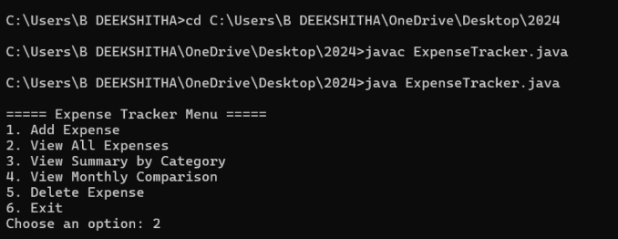
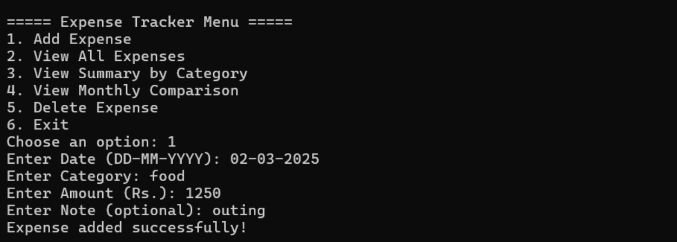
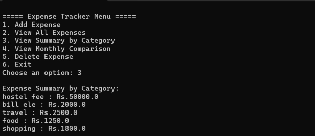
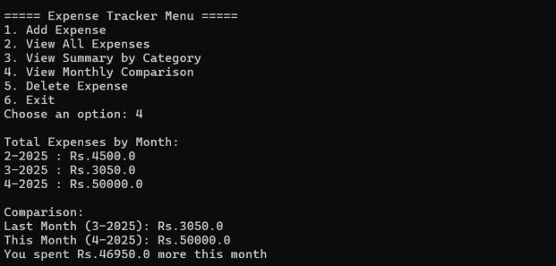

# Expense Tracker Application

## Overview

The Expense Tracker Application is a Java-based console application that helps users record, manage, and analyze daily expenses. The application allows users to add expenses, view expense history, generate category-wise summaries, compare monthly spending, and delete expense records.

This project was developed to demonstrate core Java concepts such as Object-Oriented Programming, Collections Framework, File Handling, Exception Handling, and Date Processing.

---

## Features

* Add Expense
* View All Expenses
* Category-wise Expense Summary
* Monthly Expense Comparison
* Delete Expense Records
* Persistent Data Storage using File Handling

---

## Technologies Used

* Java
* Object-Oriented Programming (OOP)
* ArrayList
* HashMap
* File Handling
* Serialization
* Exception Handling
* SimpleDateFormat
* Calendar

---

## Project Structure

```text
Expense-Tracker/
│
├── ExpenseTracker.java
├── README.md
│
├── docs/
│   └── Expense_Tracker_Report.pdf
│
└── screenshots/
    ├── menu.png
    ├── add_expense.png
    ├── summary.png
    └── monthly_comparison.png
```

---

## Screenshots

### Main Menu



### Add Expense



### Expense Summary



### Monthly Comparison



---

## How to Run

1. Clone the repository.
2. Open the project in any Java IDE.
3. Compile the Java source file.
4. Run the `ExpenseTracker` class.
5. Use the console menu to manage expenses.

---

## Concepts Implemented

* Object-Oriented Programming
* Collections Framework
* File Handling
* Exception Handling
* Date Processing
* Data Persistence

---

## Future Enhancements

* Search Expense Feature
* Edit Expense Feature
* Budget Tracking
* GUI using Java Swing or JavaFX
* Database Integration
* Report Generation

---

## Contributors

* B. Deekshitha
* I. Meghana
